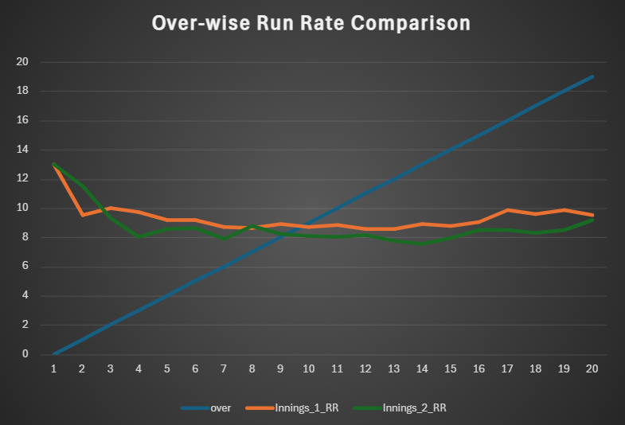
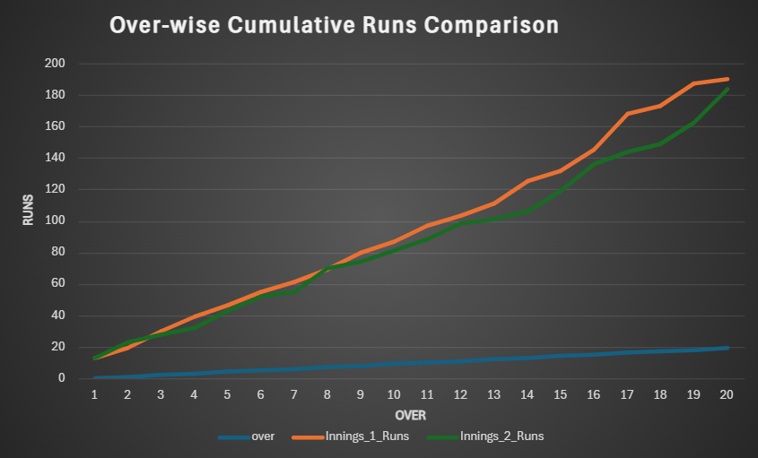

# Cricket Match Performance Analytics (Excel)🏏

##  Project Definition
This project analyzes **ball-by-ball cricket match data** and transforms it into **over-wise, cumulative, and match-level performance insights**.  
The objective is to demonstrate how raw sports data can be cleaned, aggregated, analyzed, and visualized to support performance evaluation and decision-making.

This project was developed as part of preparation for an **analytics internship (JioStar)**, focusing on clarity, correctness, and insight generation.

---

##  Objectives
- Convert raw ball-by-ball data into structured over-wise summaries  
- Analyze scoring patterns and wicket progression  
- Compare innings performance using cumulative runs and run rate  
- Identify key turning points in the match  
- Present results in a clear, interview-ready format  

---

## 📂 Dataset Description
The dataset contains **ball-by-ball match information**, where each row represents one delivery.

Key attributes include:
- Match and venue details  
- Innings and over number  
- Runs scored (batter + extras)  
- Wicket information  
- Teams and match outcome  

---

## 🗂 Folder / File Structure
```
cricket-match-analytics/
│
├── cricket_analysis.xlsx
│   ├── Live_Match_Data
│   ├── over_wise_summary
│   ├── match_summary
└── README.md
```

---

##  Methodology

### 1️⃣ Data Preparation
- Used the Live_Match_Data sheet as the raw input  
- Verified correct mapping of innings, overs, runs, and wickets  
- Filtered invalid or blank rows  

### 2️⃣ Over-wise Aggregation
- Calculated total runs per over  
- Counted wickets per over  
- Ensured one row per over  

### 3️⃣ Cumulative Metrics
- Computed cumulative runs  
- Computed cumulative wickets  
- Derived over-wise run rate  

### 4️⃣ Match-Level Summary
- Total runs, wickets, overs, and run rate per innings  

---

## 📊 Charts & Visualizations

### 📈 Over-wise Run Rate Comparison
This chart compares the scoring efficiency of both innings across overs.



### 📉 Over-wise Cumulative Runs Comparison
This chart highlights scoring momentum and key turning points in the match.




---

## 📋 Results (Match Summary)

| Innings | Runs | Wickets | Overs | Run Rate |
|--------|------|---------|-------|----------|
| 1 | 190 | 9 | 20 | 9.5 |
| 2 | 184 | 7 | 20 | 9.2 |

---

##  Key Insights
- Similar run rates but different wicket patterns  
- Innings 1 managed death overs better  
- Innings 2 collapse reduced chase efficiency  

---

##  Tools & Technologies
- Microsoft Excel  
- SUMIFS, COUNTIFS, FILTER, UNIQUE  
- Line charts  

---

##  Conclusion
This project demonstrates how raw cricket data can be converted into meaningful insights using Excel through structured aggregation and visualization.
